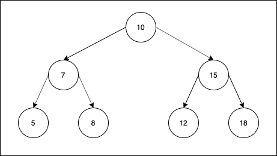

> ### All data structures implementations
>
> For a list of all the data structures I have implemented, click [here](https://gist.github.com/contactsunny/4a97886c7da57461efa8cd2538a49dbc).

---

# Binary Search Tree Implementation POC in Java

This is a simple example of a binary search tree implementation in Java. We create a custom ```Node``` class which can take values of
integer type. We also create a ```BinarySearchTree``` class which will hold the actual binary searxh tree.

We provide three major traversals for our binary tree:
- pre order traversal
- in order traversal
- post order traversal

# Running the project

Once you clone this repo, ```cd``` into the project root directory and run the following command to compile and build this maven project:

```shell script
mvn clean install
```

Once you run this command, Maven will build the project and keep it in the ```/target``` directory in the project root directory.
You can run the program using the command below:

```shell script
java -jar target/binary_search_tree_implementation_poc-1.0-SNAPSHOT.jar
```

# Illustrating different traversals

For our example, we'll consider the following binary tree, which is a very simple example: 



The following traversals are for this example binary tree:

### Pre order traversing:

In this type of traversal, we first traverse to the node, then the left child, then the right child. You can create
a much longer tree in your example and find out how it functions when there are move levels.

```shell script
10 7 5 8 15 12 18
```

### In order traversing:

In this type of traversal, we first traverse to the left child, then the node, then the right child.

```shell script
5 7 8 10 12 15 18
```

### Post order traversing:

In this type of traversal, we first traverse to the left child, then the right child, and finally the node, .

```shell script
5 8 7 12 18 15 10
```